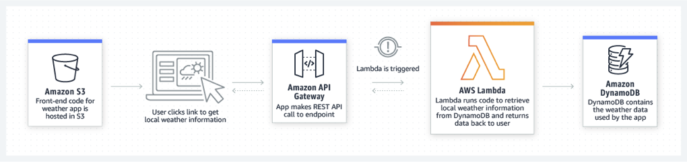

# AWS LABS

# APPLICATION

Services to implements a simple TODO(s) application. The services have been developed in **typescript**  using [SDK JavaScript SDK for Node.js](https://aws.amazon.com/sdk-for-node-js/)

## AWS Use Case

## AWS Services

 Service | Description
  --- | ---
 DynamoDB | Storage
 Lambda | Serverless Computing
 S3 | Hosting
Cognito | Security (_not yet implemented_)

## Tools

Name | Description
 --- | ---
[AWS CLI](https://aws.amazon.com/cli/) | AWS Command Line Interface
[Serverless](https://serverless.com/) | Test & Deployment

### References

[Jerry Hargrove - Cloud Diagrams & Notes](https://www.awsgeek.com/)
